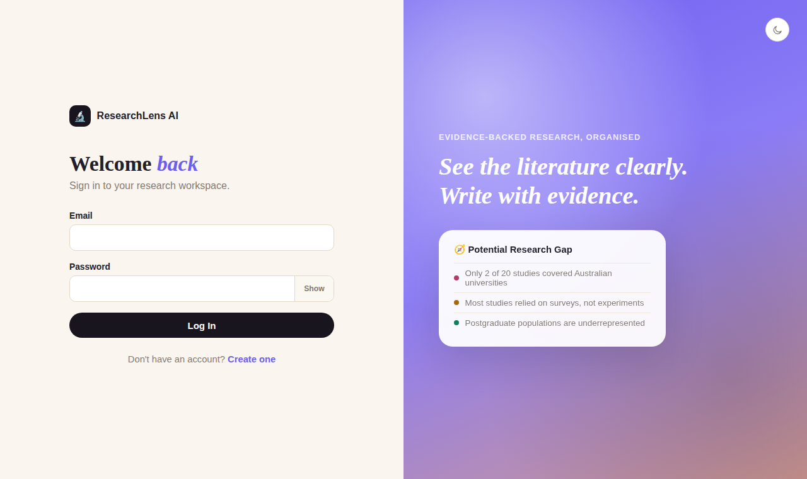
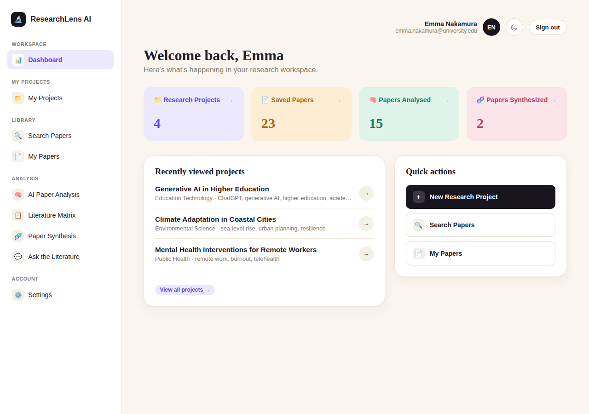
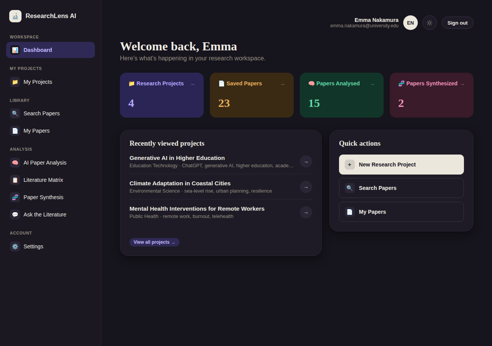
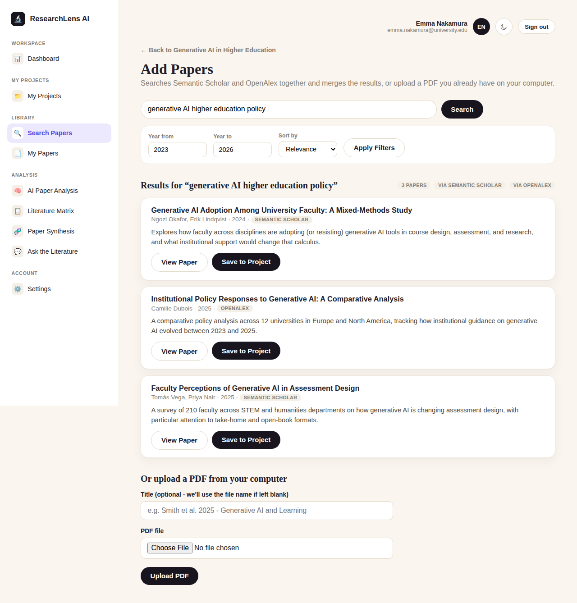
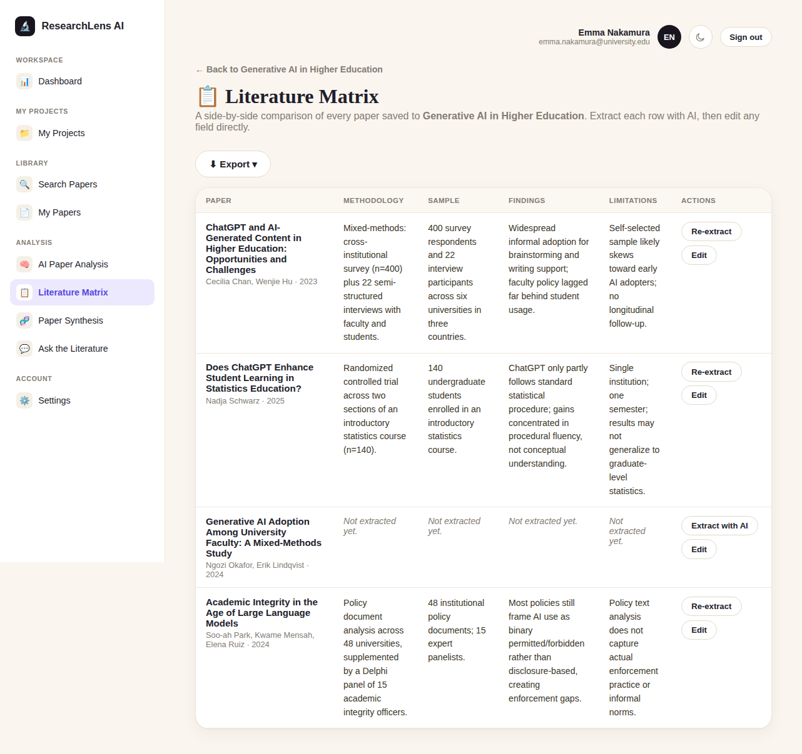
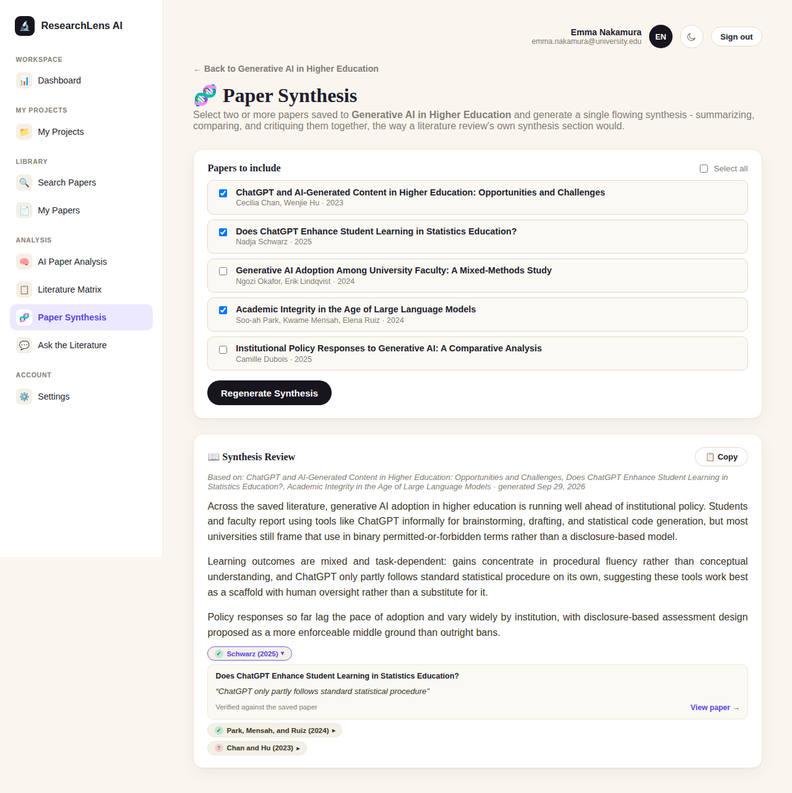
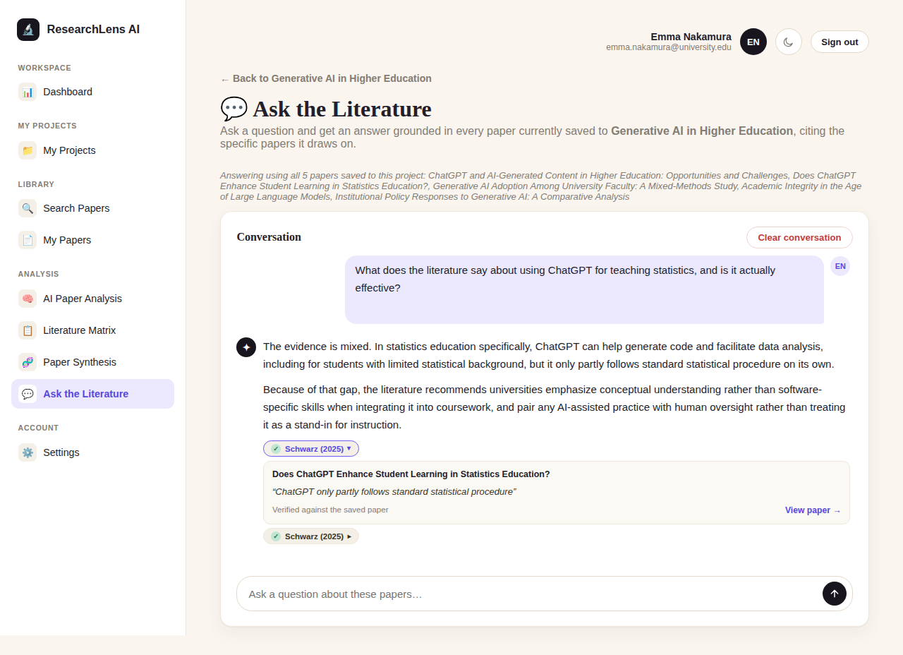

# ResearchLens AI

**An AI-assisted research workspace that cites its sources.** Search academic
literature across two scholarly APIs, save papers to a project, and get AI
summaries, a structured comparison matrix, a multi-paper synthesis, and a
ChatGPT-style Q&A chat over your own saved papers — where every AI answer
links back to the exact paper and sentence it drew from, verified against the
paper's own text. Built end-to-end with Flask, SQLAlchemy, and a hand-written
HTML/CSS/JS frontend — no frontend framework, no UI kit.


---

## Why this project

Most "AI summary" tools ask you to trust a block of generated text with no
way to check it. ResearchLens AI doesn't: every claim its AI makes — in a
chat answer, a paper synthesis, or a one-paragraph summary — is tagged with
the exact paper and the exact sentence it came from, and that quote is
checked server-side against the paper's own saved text before it's ever
shown. If the quote doesn't match verbatim, it's still shown, just labeled
differently, instead of silently hidden. That mechanic — turning "trust the
AI" into "check the AI" — is the core idea the rest of the app is built
around.

## Screenshots

<p align="center"><br><sub>Login / registration, with the light-dark theme toggle visible in the top bar</sub></p>

<p align="center"><br><sub>Dashboard — stat cards, recent projects, quick actions</sub></p>

<p align="center"><br><sub>The same dashboard in dark mode — one toggle, applied app-wide</sub></p>

<p align="center"><br><sub>Searching Semantic Scholar + OpenAlex in one query, with PDF upload as an alternative</sub></p>

<p align="center"><br><sub>Literature Matrix — AI-extracted or hand-edited, exportable to Excel/PDF/Word (note the two un-extracted rows — both states are supported)</sub></p>

<p align="center"><br><sub>Paper Synthesis — a flowing AI narrative across chosen papers, with an evidence chip expanded to show its source quote</sub></p>

<p align="center"><br><sub>Ask the Literature — a running chat grounded in a project's saved papers, citing its source sentence by sentence</sub></p>

> These are rendered from a demo dataset for this README, not live screenshots of a
> deployed instance — run the app locally (see [Getting started](#getting-started)) to
> try it with your own papers.

## Highlights

- **Evidence-tracked AI answers.** Ask the Literature, Paper Synthesis, and the AI
  Summary each append a machine-readable citation block that's parsed out, checked
  quote-by-quote against the real source text, and rendered as a clickable chip —
  verified or not, never hidden.
- **Grounded Q&A chat.** A persistent, ChatGPT-style conversation per project, scoped to
  that project's saved papers, with edit-and-resend on any earlier question.
- **Multi-paper synthesis.** Pick any set of saved papers and get one flowing,
  citation-backed narrative across them, instead of reading each paper's summary
  separately.
- **Structured comparison matrix.** A Methodology / Sample / Findings / Limitations
  table across a project's papers, AI-extractable row by row or edited by hand,
  exportable to Excel, PDF, and Word from the same data.
- **Dual-source search.** Semantic Scholar and OpenAlex queried together and
  de-duplicated by DOI, plus direct PDF upload with text extraction.
- **Hand-built frontend.** No React, no Bootstrap — Jinja2 templates, vanilla JS, and a
  single CSS file implementing a full light/dark design system with CSS custom
  properties.
- **Session auth and per-user access control** on every project/paper query, not just
  at the login gate.

## Tech stack

| Layer | Choice |
|---|---|
| Backend | Python, Flask (blueprints: auth / main / papers / settings) |
| Database | SQLite via SQLAlchemy ORM, with a lightweight in-code column-migration helper |
| AI | OpenAI Responses API, streamed token-by-token to the browser |
| Literature search | Semantic Scholar API, OpenAlex API |
| PDF handling | PyMuPDF (text extraction), reportlab (PDF export) |
| Document export | openpyxl (Excel), python-docx (Word) |
| Auth | bcrypt password hashing, signed session cookies |
| Frontend | Jinja2, vanilla JavaScript (`fetch()` streaming), hand-written CSS (no framework) |

## Architecture

```
Browser → routes/ (controllers) → services/ (business logic, DB access) → models/ (SQLAlchemy)
                                        ↓
                            templates/ (Jinja2) → HTML back to browser
```

A normal page request is the straightforward Flask loop: a route matches the URL, calls
into `services/` to read or write the database, picks a template, and returns HTML. The
AI features work differently — the browser opens a streaming `fetch()`, and
`services/openai_service.py` streams tokens back from OpenAI's Responses API through the
Flask route to the page in real time, the same way ChatGPT's own answers appear word by
word. For the three evidence-tracked features, the model is also instructed to append a
trailing, machine-readable citation block after its normal answer;
`services/evidence_service.py` strips that block before anything is shown or saved,
verifies each quote against the exact source text the model was given, and the page
renders the result as small citation chips — the raw block itself is never visible, even
for a split second while the answer is still streaming in.

Every query for a specific project or paper filters by the *requesting user's own id*,
not just the record's id, which is what stops one account from viewing or guessing into
another account's data.

<details>
<summary><strong>Full project structure</strong> (click to expand)</summary>

```
researchlens-ai-flask/
├── app.py                        ← entry point: run this file. Creates the Flask app,
│                                    registers all four blueprints, sets up the
│                                    `initials` template filter and the `current_user`
│                                    context processor.
├── routes/                       ← controllers: handle requests, call services
│   ├── auth_routes.py             ← /login, /register, /logout
│   ├── main_routes.py             ← / (dashboard), research-project CRUD
│   ├── papers_routes.py           ← search, save/remove, PDF upload, My Papers,
│   │                                 paper detail pages, the AI Analysis hub, AI
│   │                                 summary/relevance streaming, the Literature
│   │                                 Matrix (AI extraction, manual edit, Excel/PDF/
│   │                                 Word export), Paper Synthesis, Ask the
│   │                                 Literature (ask/edit/resend/clear), and the
│   │                                 multi-note endpoints (add/edit/delete)
│   └── settings_routes.py         ← Settings page: name/password change, account deletion
├── services/                     ← business logic, the only layer that touches models
│   ├── database_service.py        ← database connection, session factory, init_db(),
│   │                                 and the lightweight column-migration mechanism
│   │                                 (_ADDED_COLUMNS) used to grow the schema in
│   │                                 place without a migrations framework
│   ├── auth_service.py            ← password hashing (bcrypt), user CRUD
│   ├── project_service.py         ← research-project CRUD, "recently viewed", and
│   │                                 storing/reading a project's Paper Synthesis
│   │                                 (text, source papers, and its evidence)
│   ├── paper_service.py           ← saving/removing papers, access control, the
│   │                                 multi-note functions, Literature Matrix fields,
│   │                                 and storing/reading the AI Summary's evidence
│   ├── literature_chat_service.py ← Ask the Literature's conversation history: one
│   │                                 row per turn, edit-and-truncate for a resent
│   │                                 question, and each answer's evidence
│   ├── evidence_service.py        ← evidence tracking: the trailing-block prompt
│   │                                 instructions every AI feature appends, parsing
│   │                                 that block back out, verifying each quote
│   │                                 against the exact source text the model was
│   │                                 shown, and building citation labels like
│   │                                 "Huang and Lee (2025)" from a paper's own
│   │                                 authors/year
│   ├── pdf_service.py             ← validating and saving uploaded PDFs, text
│   │                                 extraction via PyMuPDF
│   ├── semantic_scholar_service.py ← Semantic Scholar API client
│   ├── openalex_service.py        ← OpenAlex API client (rebuilds abstracts from
│   │                                 their "inverted index" format)
│   ├── openai_service.py          ← OpenAI Responses API integration: streams the
│   │                                 AI Summary, Relevance Analysis, Literature
│   │                                 Matrix extraction, Paper Synthesis, and Ask the
│   │                                 Literature answers back to the browser as
│   │                                 they're generated, wiring evidence_service.py
│   │                                 into the three features that support it
│   └── export_service.py          ← builds the Literature Matrix's Excel (openpyxl),
│                                     PDF (reportlab), and Word (python-docx) exports
│                                     from the same saved-papers data
├── models/                       ← one file per database table
│   ├── user.py
│   ├── project.py                 ← a research project, plus its current Paper
│   │                                 Synthesis (text, source paper ids, evidence)
│   ├── paper.py                   ← a paper found via search or uploaded as a PDF,
│   │                                 its AI Summary and Summary evidence, and its
│   │                                 Literature Matrix fields
│   ├── saved_paper.py             ← join table: which paper is saved to which
│   │                                 project, plus that project's own relevance
│   │                                 analysis and notes for it
│   ├── note.py                    ← a single user note attached to a saved paper
│   │                                 (a saved paper can have any number of notes)
│   └── literature_chat_message.py ← one turn (question or answer) of a project's
│                                     Ask the Literature conversation, plus that
│                                     answer's evidence
├── templates/                    ← the HTML (Jinja2 templates)
│   ├── base_auth.html             ← shared layout for login/register (incl. the
│   │                                 light/dark theme toggle)
│   ├── base_app.html              ← shared layout for logged-in pages (sidebar,
│   │                                 topbar, theme toggle + content)
│   ├── login.html / register.html
│   ├── dashboard.html
│   ├── projects.html / new_project.html / edit_project.html / project_detail.html
│   ├── choose_project.html        ← pick a project before searching, opening the
│   │                                 matrix, synthesizing, or asking a question, if
│   │                                 you have more than one project
│   ├── paper_search.html          ← search form, results, filters, pagination
│   ├── project_papers.html        ← a project's full list of saved papers
│   ├── project_paper_detail.html  ← a saved paper within a project: AI Summary
│   │                                 (with evidence), Relevance Analysis, and notes
│   ├── paper_detail.html          ← a paper's own page, independent of any one
│   │                                 project, with its AI Summary and evidence
│   ├── my_papers.html             ← every paper saved across all of a user's projects
│   ├── ai_analysis.html           ← the "AI Paper Analysis" hub: every saved paper,
│   │                                 which projects it's in, and its analysis status
│   ├── literature_matrix.html     ← the structured comparison table (Methodology /
│   │                                 Sample / Findings / Limitations per paper), AI
│   │                                 extraction, inline manual editing, and the
│   │                                 Excel/PDF/Word export dropdown
│   ├── paper_synthesis.html       ← pick a project's papers, generate a flowing
│   │                                 synthesis across them, with its citation evidence
│   ├── ask_literature.html        ← the ChatGPT-style Ask the Literature chat: avatar
│   │                                 rows, hover-reveal edit/copy icons, streamed
│   │                                 answers with evidence chips per citation
│   └── settings.html              ← profile, password change, danger zone (delete account)
├── static/
│   ├── css/style.css              ← the whole design system in one file (Fraunces +
│   │                                 Inter fonts, light/dark color palettes via CSS
│   │                                 custom properties, cards, panels, the chat UI,
│   │                                 evidence chips, and the streaming-output styling)
│   └── js/app.js                  ← password show/hide, confirm-before-delete
│                                     dialogs, auto-dismissing flash messages, the
│                                     light/dark theme toggle, the fetch-based
│                                     streaming client shared by AI Summary/Relevance
│                                     Analysis/Matrix extraction/Paper Synthesis, the
│                                     Ask the Literature chat client (ask, edit,
│                                     resend, copy), and rendering each feature's
│                                     evidence chips as they stream in
├── docs/screenshots/             ← the screenshots used in this README
├── database/                     ← researchlens.db (SQLite file), created here on first run
├── uploads/                      ← uploaded PDFs, saved under randomly generated
│                                     filenames so two users' files never collide
├── data/                         ← reserved for future features (e.g. cached embeddings)
├── requirements.txt
├── .env.example                  ← copy to .env and fill in your keys
└── .gitignore
```

</details>

## Feature tour

<details>
<summary><strong>Foundation & authentication</strong></summary>

- Secure registration, login, and logout, with passwords hashed and salted via bcrypt
  (never stored in plain text).
- Session-based authentication guarding every workspace page.
- A dashboard with stat cards and a "recently viewed" projects list.
- Research-project management: create and view.
- A Settings page for updating display name and password, both re-checked against the
  current password before saving.
- Full account deletion (password-confirmed, cascading to the account's own projects
  and saved papers).

</details>

<details>
<summary><strong>Academic research discovery</strong></summary>

- Combined paper search across **Semantic Scholar** and **OpenAlex**, two free,
  official scholarly APIs, merged and de-duplicated by DOI (falling back to title) so
  the same paper never appears twice.
- Year-range filtering and sort-by (relevance / newest / oldest), with server-side
  pagination.
- Full project CRUD (create, edit, delete) and a save/remove workflow linking papers
  to a project's library.
- Direct PDF upload with text extraction via PyMuPDF.
- The complete custom Flask + Jinja2 + hand-written CSS interface (Fraunces for
  headings, Inter for body text) — no frontend framework.

</details>

<details>
<summary><strong>AI paper analysis</strong></summary>

- **OpenAI-powered AI Summary:** a structured, 300–500 word summary generated for any
  saved paper, streamed live into the page as it's written. The summary always renders
  as six distinct, justified paragraphs in a fixed order — author(s) and research
  question, problem statement and proposed solution, methodology, results/findings,
  conclusion, and critical reflection.
- **Relevance Analysis:** an AI-generated assessment of how relevant a saved paper is
  to a project's specific research question, also streamed live.
- **Per-paper detail page:** one place to read a saved paper's abstract, generate or
  re-read its AI Summary and Relevance Analysis, and manage its notes, scoped to the
  project it's saved in.
- **"AI Paper Analysis" hub page:** every paper saved across all of a user's projects
  in one view, showing which projects each paper belongs to and whether it's been
  analyzed yet.
- **Multi-note system:** any number of free-text notes per saved paper, each with an
  optional custom title, addable/editable/deletable independently.

</details>

<details>
<summary><strong>Research intelligence</strong></summary>

- **Literature Matrix:** a structured, row-per-paper comparison table across every
  paper saved to a project, with four fixed columns — Methodology, Sample, Findings,
  Limitations. Each row can be filled in with one click ("Extract with AI", streamed
  live) or edited by hand at any time, since the two aren't mutually exclusive.
  Exportable as a formatted **Excel workbook**, **PDF**, or **Word document**, all
  three built from the same data so they never drift apart.
- **Paper Synthesis:** pick any two or more papers saved to a project and generate a
  single flowing, multi-paragraph AI narrative across them — summarizing, comparing,
  and critiquing them together, the way a literature review's own synthesis section
  would, rather than one row per paper.
- **Ask the Literature:** a running, ChatGPT-style Q&A conversation scoped to one
  project, answered using every paper currently saved to it. Questions and answers
  persist as a real conversation history; an earlier question can be edited, which
  discards everything asked after it and generates a fresh answer.

</details>

<details>
<summary><strong>Evidence tracking & design polish</strong></summary>

- **Evidence tracking:** Ask the Literature, Paper Synthesis, and the AI Summary each
  cite their sources at the sentence level, not just "trust the AI." The model is
  instructed to append a trailing block naming exactly which paper (or, for the AI
  Summary, which of its six paragraphs) each part of its answer came from, along with
  a verbatim quote and the cited paper's title. The server parses that block out,
  checks each quote as an exact match against the real text the model was shown, and
  renders the result as a small citation chip under the relevant text — click it to
  see the paper's title, the quote, a "View paper →" link, and whether it was
  verified. An unverified quote is still shown, just labeled differently, rather than
  silently hidden — a paraphrase or a quote drawn from matrix-derived text can
  legitimately fail an exact-match check without being wrong. During live streaming,
  the trailing block itself is never visible, even for a fraction of a second.
- **Ask the Literature redesign:** the chat thread matches a modern AI chat product —
  avatar-initialed rows, an unboxed assistant answer versus a compact bubble for your
  own question, hover-reveal icon actions (pencil to edit, clipboard to copy), and a
  rounded-pill composer with a circular send button.
- **Light/dark theme:** a moon/sun toggle in the top bar (and on the login/register
  screens) switches the whole app between a light and a dark palette, persisted per
  browser and applied before the very first paint so there's no flash of the wrong
  theme on load.

</details>

## Getting started

### 1. Prerequisites

- [Python 3.11+](https://www.python.org/downloads/) (on Windows, tick "Add Python to
  PATH" during install)
- A code editor — [VS Code](https://code.visualstudio.com/) with the Python extension
  works well

### 2. Clone and set up a virtual environment

```bash
git clone <this-repo-url>
cd researchlens-ai-flask
python -m venv venv
```

Activate it:

```bash
# Windows (PowerShell)
venv\Scripts\Activate.ps1
# Mac / Linux
source venv/bin/activate
```

Your terminal prompt should now start with `(venv)`. Re-activate every time you open a
new terminal.

### 3. Install dependencies

```bash
pip install -r requirements.txt
```

Installs Flask, SQLAlchemy, bcrypt, python-dotenv, requests, PyMuPDF (PDF text
extraction), the `openai` client, and openpyxl / reportlab / python-docx (Literature
Matrix export to Excel, PDF, and Word).

### 4. Set up your API keys

Copy `.env.example` to a new file named `.env` in the project root, then fill in:

- **`FLASK_SECRET_KEY`** — any long random string, used to sign login session cookies.
  Generate one with `python -c "import secrets; print(secrets.token_hex(32))"`.
- **`OPENAI_API_KEY`** — required for every AI feature: AI Summary, Relevance
  Analysis, the Literature Matrix's AI extraction, Paper Synthesis, and Ask the
  Literature. Get one at [platform.openai.com/api-keys](https://platform.openai.com/api-keys).
  Without a key, those buttons show an "Add an OpenAI key" message instead of failing
  silently — the rest of the app works fine without it.
- **`SEMANTIC_SCHOLAR_API_KEY`** — optional. Paper search works without it (OpenAlex
  needs no key at all), but a free key raises Semantic Scholar's rate limit above the
  shared, unauthenticated pool. Request one at
  [semanticscholar.org/product/api](https://www.semanticscholar.org/product/api#api-key).

`.env` is git-ignored, so your keys are never committed.

### 5. Run it

```bash
python app.py
```

Open the printed address (typically `http://127.0.0.1:5000`) — you should see the
ResearchLens AI login screen.

<details>
<summary><strong>A quick walkthrough once it's running</strong></summary>

1. Click **Create one** (register), fill in the form, submit.
2. You'll land on the Dashboard, signed in.
3. Click **+ New Research Project**, create one, see it appear on your dashboard.
4. Open the project, click **Search Papers**, search for a topic, and save a result
   to the project (or upload a PDF instead).
5. Open a saved paper and click **Generate AI Summary** or **Analyze Relevance**
   (requires an OpenAI key) to watch the analysis stream in live, then add a note.
6. Save at least two papers to a project, open **Literature Matrix**, click
   **Extract with AI** on a row, then **Paper Synthesis** to generate a combined
   narrative across a chosen set of papers.
7. Open **Ask the Literature** and ask a question about the project's saved papers —
   the answer streams in like a chat message, with a small citation chip under it for
   each paper it drew from. Click a chip to see the exact quote and whether it was
   verified against that paper's own text.
8. Try the moon/sun icon in the top bar to switch between light and dark mode.
9. Click **Sign out**, then log back in with the same email/password.

To stop the app: `Ctrl+C` in the terminal.

</details>

## Roadmap

- **A minimal tool-using OpenAI Agent** as a step beyond the prompt-and-stream pattern
  every current AI feature uses.
- **A prepared offline-safe demo mode**, so the app's core flows can be shown without a
  live OpenAI/Semantic Scholar/OpenAlex connection.
- **A broader usability and AI-accuracy testing pass**, plus end-to-end testing of
  authentication and search, and general bug fixes.

Research gap detection, originally planned as a separate feature, is now effectively
covered by Paper Synthesis and Ask the Literature together — both already surface where
the saved literature agrees, disagrees, or is thin, with citations back to exactly where
each claim comes from.

---

<sub>Built as an academic capstone project, developed iteratively across five stages:
authentication & project management, literature search, AI paper analysis, research
intelligence (matrix/synthesis/chat), and evidence tracking & design polish.</sub>
